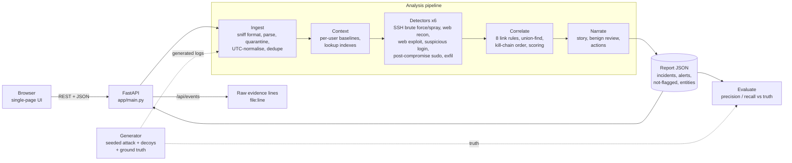

# Spoor architecture

## Data flow
1. **Ingest** (`parsers.py`): each file is sniffed (syslog, nginx, CSV, JSONL). Every line becomes an `Event` or is
   quarantined with a reason. Times become UTC. Same line in two files is dropped once.
2. **Context** (`context.py`): indexes + baselines, always computed "before time t" so an attack never pollutes its own baseline.
3. **Detect** (`detectors.py`): each detector yields `Finding`s with evidence ids, a base confidence, `positive`
   signals, applied `benign` deductions, and `checks` (innocent explanations tested and rejected).
4. **Correlate** (`correlate.py`): findings with adjusted confidence < 0.35 go to *Not flagged*. The rest are linked by
   rules R1–R8 and merged with union-find. Groups with ≥ 2 kill-chain stages (or one very strong finding) become incidents; the rest are isolated alerts.
5. **Narrate** (`narrate.py`): deterministic templates. 6. **Report** (`pipeline.py`): JSON for the UI.

## Link rules
| Rule | Links findings when… |
|---|---|
| R1 same_ip | they share a source IP |
| R2 same_toolkit | different IPs share the same scanner fingerprint (user-agent) |
| R3 ip_rotation | IP B starts attacking the same host ≤ 180 s after IP A went quiet |
| R4 credential_reuse | account U was being guessed from IP A, then IP B logs in as U |
| R5 credential_reuse | a compromised account is used again from a second new IP within 6 h |
| R6 created_account | a login uses an account created during the incident |
| R7 session | sudo commands ran inside the session opened by a flagged login |
| R8 exfil_after_access | large outbound transfer follows a compromise on the same host (≤ 12 h) |

## Scoring
`score = 1 − Π(1 − 0.9·conf_i)` over the top findings (noisy-OR), `+ 0.03 × (stages − 1)` (max 0.12),
`+ 0.03` if stages appear in kill-chain order (5-minute tolerance). Each term is shown in the UI.

## Key decisions
| Decision | Why |
|---|---|
| Rules + baselines, no ML model | Explainable, deterministic, no training data needed, testable to the line. |
| No LLM at runtime | Demo cannot fail on an API; narrative cannot invent evidence. |
| In-memory sessions, no DB | Analysis is stateless; fewer moving parts to break on stage. |
| Single HTML file UI | No build step to fail; loads instantly. |
| Generator with ground truth | Lets us *measure* detection and prove the demo is not hard-coded. |
| Suppressed list instead of silent drops | False-positive reasoning is visible to the analyst. |
